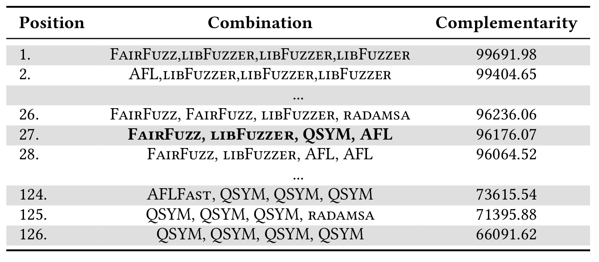
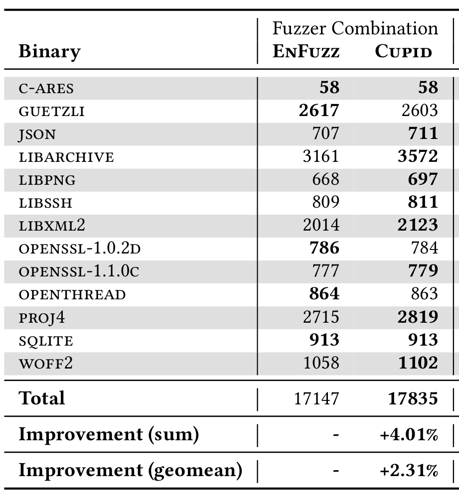
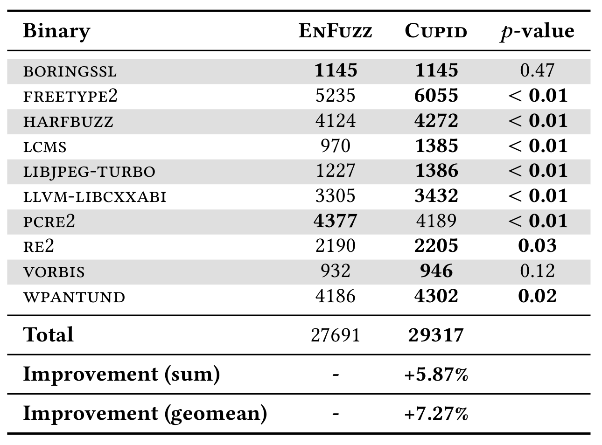
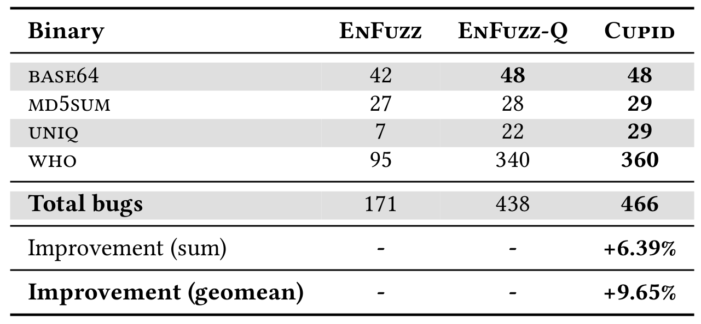

# Cupid

Please note that this is the *artifact evaluation* repository of Cupid. If you're looking for the main repository, please click here: https://github.com/RUB-SysSec/cupid

# Installation & Information

Please use the ready-to-go Debian [VirtualBox image (download)](https://ruhr-uni-bochum.sciebo.de/s/PolO2GCAvgdk2Al), not only to avoid the time consuming task of installing all dependencies, generating docker images and copying all the data, but also to avoid damages to the file system as our code needs to harshly terminate some of the fuzzers in the rare cases when they refuse to be killed.

The VM image was created with VirtualBox 6.1.12, we recommend using at least this version to import the image. For install instructions, please refer to [this guide](https://www.virtualbox.org/wiki/Downloads).

Import the image in VirtualBox (double clicking on the .ova file should work on most operating systems, but alternatively click on File -> Import Appliance and then select the .ova image file and follow the instructions). Finally, boot the the system.  

If VirtualBox complains about a missing extension pack (e.g., due to USB 2.0 support), please install the extension pack. Additionally, VirtualBox might complain about missing guest additions, which was needed to copy the artifact data and source code via a shared folder, but it is not necessary for this artifact evaluation (i.e., you can safely ignore the message). Additonally, if `A start job is running` is shown, please wait a few minutes until the VM boots.  

The credentials are set as "cupid:cupid" and "root:root". Please login as cupid. The home directory contains the following directories:  

`2019-collfuzz-tests/`: this is the main source code, the engine of Cupid which consists of the fuzzer drivers and a control mechanism for their respective docker images (described in the paper in section 5.2.1). In `docker/` one can find all Dockerfiles for the respective fuzzers. The VM image comes with prebuilt AFL docker images.  
`2019-quickcov/`: a small library to quickly gather branch coverage information. Internally, it uses AFL as a library. Described in section 5.2.2.  
`artifact/`: contains all the artifact data for the evaluation in section 6.  

This README also serves as a documentation for the artifacts and scripts, as seen in the following sections. Most of the artifact data can be found in this repository under `data/`.  

# Evaluation

We divide the artifact evaluation into two steps:  

1. Testing the source code
2. Regenerating the evaluation results as presented in the paper

## Testing the source code

Change the current directory to `~/2019-collfuzz-tests/`. First, please execute `bash cpu.sh` to make extra sure that AFL is ready for execution (this will likely output an error, which is expected) and then execute `./run.sh`. The latter is a small script that executes:
```
python3 control.py --num-fuzzers 2 --timeout 60 
                   --interval 60 --mode afl,afl 
                   --binary base64
```
where  
`control.py`: this is the main source file that parses the arguments and starts the given fuzzers  
`--num-fuzzers`: defines how many parallel fuzzers should run. Keep this to the number of fuzzers given by `--mode`. This is a superfluous legacy flag that will be removed in the future.  
`--timeout 60`: how many seconds to run.  
`--interval 60`: this is a legacy flag and is not used in Cupid, keep it at the same value as timeout. Will be removed in the future.  
`--mode afl,afl`: this command starts two parallel instances of AFL. In the VM image, we have adjusted the build scripts to only generate the docker images for AFL and LAVA-M's base64 to keep the image size small and manageable (building the full docker images, including all binaries, requires ~100GB of disk space).  
`--binary base64`: defines which binary to run (in this case, it's LAVA-M's base64).  

Wait ~one minute until the execution is done. Now one can inspect the queue files in `/dev/shm/sync*` (e.g. `/dev/shm/sync817/fuzzer-afl-slave-0-817/queue/`). If queue files were created, everything is working fine.

If one wants to inspect the output while its running, we recommend redirecting the output to a file and then exploring it via `nano`, or executing it in a screen session and use the scrollback buffer (screen is already installed).  
Additionally, if you want to watch the fuzzers while running, execute run.sh in the background (`run.sh &`), then use `screen -ls` to list all currently running fuzzers (all fuzzers run in a screen session which executes the docker image), and finally use `screen -x afl-fuzzer-slave-0` (or similar) to watch the fuzzing process of AFL. You can also use `docker ps` to list all running docker containers.  

Note that `run.sh` terminates after 60s, so be sure to run these commandy quickly while its still running in the background or increase the 60 in the script.

If one wants to activate support for additional fuzzers and binaries, please refer to the chapter in the appendix called ["Activating more fuzzers and binaries"](#activating-more-fuzzers-and-binaries)

## Regenerating evaluation results

As the evaluation of our project cost 40'000 hours of CPU time, it is not feasible to rerun the whole evaluation. Additionally, supplying the raw queue files would also exceed any reasonable disk constraint (i.e., the training data alone exceeded 200GB). Instead, we supply the python data generated during and after the evaluation, specifically python3 pickle files. 

Additionally, we provide scripts for further inspection which are not meant to be run, but to demonstrate how the pickle files were created. An explanation of these scripts can be found in the appendix of this document (["Further inspection"](#further-inspection)).  

Please change the directory to `~/artifact` and execute `run.sh`. This script regenerates most of the evaluation data as seen in the paper in section 6. The expected output can be found [here](data/artifact_out.txt). The following sections present a more detailed explanation of the output.

### Training

This step uses the training data as described in section 5.1 to calculate its prediction for a combination of size n=4. You can compare this full table to the extract in Table 5 in the appendix of the paper, shown here (from the paper):  

  

### Pearson correlation coefficient

This calculates the Pearson correlation coefficient as described in section 6.2.1. You can compare the data in the resulting table to the information given in the aforementioned section. Mainly, the first experiment needs to display a coefficient of **~0.81** and the second experiment around **~0.61**. It also displays the correlation coefficient on a per-binary basis.

### Fuzzer-Test-Suite

In this artifact evaluation, we use the plot information given by all the fuzzing runs on the fuzzer-test-suite binaries to compare the combination of EnFuzz to Cupid's selection. The output is expected to match the data in section 6.2.2, as shown here for the test binaries (from the paper):  

  

and the trainings binaries (from the paper):  

  

Mainly, the geomean improvement of the test binaries should be around **+2.32%** and the trainings binaries around **+7.25%**.

### Evaluating on Lava-M

This is the last artifact evaluation and concerns section 6.2.3. The resulting table should be similar to Table 3 in the paper, as shown here (from the paper): 

  

Note that this table will not be identical as some runs on `md5sum` are unfortunately corrupt and it would take some time to find the bug and rerun the experiment. Although the general tendency of the `md5sum` evaluation still reflects the data shown in the paper (i.e., `EnFuzz` < `Cupid`), the data point of `EnFuzz-Q` with `md5sum` could not be restored. This is the only data point affected by this. As shown by the other binaries, the combination of `EnFuzz-Q` does indeed generally work.

# Appendix

## Further inspection

### Pickle files

The pickle files were created with Python3 (we recommend at least 3.6.9). If you try to load the pickle files, python3 might complain about an undefined `rec_dd`. Please define the following function:  

```python
def rec_dd():
    return defaultdict(rec_dd)
```

Most of the pickle files are basic data types, mostly dictionaries. An example usage would be:  

```python
import pickle

def rec_dd():
    return defaultdict(rec_dd)

with open("data.pickle", "rb") as f:
	a = pickle.load(f)

# data is now loaded in "a", print it:
print(a)
# if it's too much data to print, 
# print the type, if it is a dictionary, 
# first print the keys
if isinstance(a, dict):
	print(a.keys())
```

### Training

In the `artifact/training/generator/` directory one can find a ~500MB pickle file containing all branches seen for all combinations of training binary + seed + fuzzer. The file  
`artifact/training/total_fuzzer_runs_limited.pickle`  
contains the resulting data after applying the algorithms described in section 4.2 of the paper, which was used to generate the table. Additionally, for further inspection we provide `analyze.py` that was used to extract the branch coverage information from the collected queue files and to apply the algorithms mentioned earlier. Note that the formatting of the script might look peculiar as it originally was a jupyter notebook, which was exported to a single python file.

### Evaluating Lava-M

In the directory `artifact/lava_m/generator/` one can find the jupyter notebook file that was used to extract the bug IDs from the queue/crash files. It basically runs the buggy version of the LAVA-M binaries with every queue file and extracts the bug ID to calculate the median number of bugs found by each combination.

## Activating more fuzzers and binaries

In the VirtualBox image, we have only included AFL and LAVA-M's `base64` to keep the image size small. However, if you want to explore the other fuzzers and binaries, you have to first either increase the size of the VirtualBox disk image, or attach a shared folder. Note that building the complete docker package might require about 100GB of space and it could take up to 6h or more to build.

The Dockerfiles can be found at `~/2019-collfuzz-tests/docker/`. The build process consists of two main files. `docker/build.sh` builds all the docker images, and `docker/build_test_suite.py` additionally builds all fuzzer-test-suite binaries for all fuzzers.  

In the VM, we have patched those files to only build AFL with support for `base64`. To get the unpatched files, please download and replace the `docker/` folder [with this](https://ruhr-uni-bochum.sciebo.de/s/25xjrTMzciiNDmd). This one has support for all fuzzers and binaries (LAVA-M, fuzzer-test-suite).

One can regulate which fuzzers to build by commenting out the respective `docker build` commands in `docker/build.sh` and by removing the fuzzer from the `fuzzers` list variable in `docker/build_test_suite.py`, e.g. to remove `AFLFast`, change this in `docker/build.sh`:

```bash
# aflfast
docker build --tag=fuzzer-aflfast $SCRIPTPATH/aflfast/
```

to  

```bash
# aflfast
# docker build --tag=fuzzer-aflfast $SCRIPTPATH/aflfast/
```

and change this in `docker/build_test_suite.py`:

```python
fuzzers = ["qsym", "afl", "aflfast", 
           "fairfuzz", "libfuzzer", 
           "honggfuzz", "radamsa", 
           "angora"] 
```

to  

```python
fuzzers = ["qsym", "afl", "fairfuzz", 
           "libfuzzer", "honggfuzz", 
           "radamsa", "angora"] 
```

Note that `angora` is included in the list, but there is no support for it as of yet.

If you want to remove specific binaries from Google's fuzzer-test-suite, comment out the lines in `docker/build_test_suite.py`:  

```python
targets = [
  "boringssl-2016-02-12",
  "c-ares-CVE-2016-5180",
  "freetype2-2017",
  "guetzli-2017-3-30",
  "harfbuzz-1.3.2",
  "json-2017-02-12",
  "lcms-2017-03-21",
  "libarchive-2017-01-04",
  "libjpeg-turbo-07-2017",
  "libpng-1.2.56",
  "libssh-2017-1272",
  "libxml2-v2.9.2",
  "llvm-libcxxabi-2017-01-27",
  "openssl-1.0.1f",
  "openssl-1.0.2d",
  "openssl-1.1.0c",
  "openthread-2018-02-27",
  "pcre2-10.00",
  "proj4-2017-08-14",
  "re2-2014-12-09",
  "sqlite-2016-11-14",
  "vorbis-2017-12-11",
  "woff2-2016-05-06",
  "wpantund-2018-02-27"
]
```

Finally, if you now want to build the docker images, execute `./docker/build.sh` and wait a few hours. If everything goes well, the fuzzers should now be supported. Run  

```bash
python3 control.py --num-fuzzers 2 --timeout 60 
                   --interval 60 --mode fuzzer1,fuzzer2 
                   --binary binary
```

where *fuzzer1* and *fuzzer2* are to be replaced by one of `afl, aflfast, fairfuzz, qsym, libfuzzer, honggfuzz, radamsa, lafintel`.  

And *binary* has to be one of `base64, md5sum, who, uniq, objdump, addr2line, ar, strings, nm-new, readelf, strip-new, boringssl, c-ares, freetype2, guetzli, harfbuzz, json, lcms, libarchive, libjpeg-turbo, libpng, libssh, libxml2, llvm-libcxxabi, openssl-1.0.1f, openssl-1.0.2d, openssl-1.1.0c, openthread, pcre2, proj4, re2, sqlite, vorbis, woff2, wpantund`

If you want to run more than two fuzzers in parallel, please increase the number of CPU cores assigned to the VirtualBox instance.
